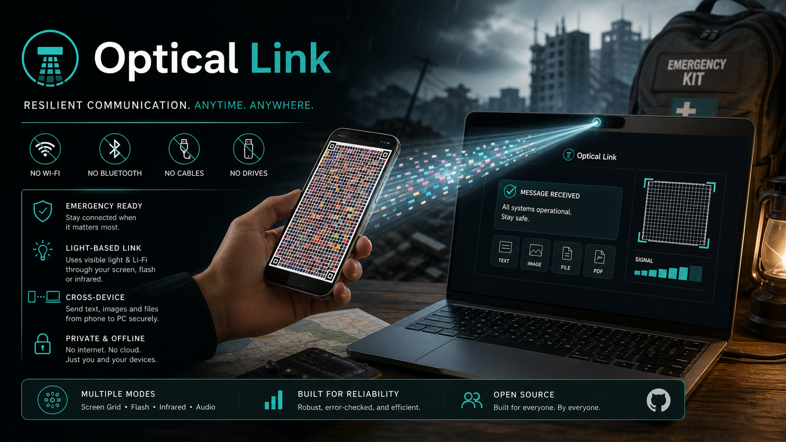

<p align="center">
  
</p>

# Optical Link

Optical Link is an experimental **phone-to-PC Li-Fi style emergency bridge**. It lets an Android phone transmit essential information to a laptop through light captured by the webcam, without needing Wi-Fi, Bluetooth, USB cable, pendrive, or any normal data link.

The project is intended as a backup communication path for degraded or catastrophic situations where the only remaining usable channel between devices is visible light, infrared, screen patterns, flashlight pulses, or similar optical signals.

> Status: experimental field prototype. Useful for testing and learning, not yet a certified emergency communications product.

## What It Does

- Android APK transmits text, images, PDFs, and files.
- Windows laptop receives through webcam using Python + OpenCV.
- Local web UI shows camera preview, decoded messages, frame logs, and receiver controls.
- Screen grid mode is the main high-throughput path.
- Flashlight and infrared modes are slow fallback experiments.
- Text and files are compressed when useful.
- The receiver runs fully local at `http://127.0.0.1:8000`.

## Why

Normal device-to-device communication assumes some infrastructure or interface still works:

- Wi-Fi
- Bluetooth
- USB cable
- storage drive
- mobile data
- cloud services

Optical Link explores a different assumption: **if one device can show light and the other can see it, a minimal data channel may still exist**.

This makes it useful as a research prototype for resilience, disaster preparedness, device recovery, and offline transfer experiments.

## Repository Layout

```text
OpticalLink/
  android/                 Android transmitter source and build scripts
  downloads/android/       Current debug APK for manual Android install
  receiver/                Python/OpenCV receiver and local webserver
  docs/assets/cover.png    AI-generated README cover
  scripts/                 Maintenance and GitHub publishing scripts
  start_receiver.ps1       Start receiver in foreground
  launch_optical_link.ps1  Start receiver if needed and open browser
  launch_optical_link.bat  Double-click launcher for Windows
  create_desktop_shortcut.bat
  bootstrap_windows_dev.bat
```

## Quick Start On Windows

### Requirements

- Windows 10/11.
- Python 3.10 or newer available as `python`.
- Webcam.
- Android phone for the transmitter APK.
- Internet only for first receiver dependency install.

To only test the included APK, users do not need Android Studio or Android SDK. To rebuild the APK from source, they need Android SDK + JDK.

Optional developer bootstrap:

```text
bootstrap_windows_dev.bat
```

This helper uses `winget` when available to install/check Git, Python, JDK, and Android Studio. Android Studio may still need one manual SDK Manager pass to install Android platform 35, build-tools, and platform-tools.

### With Codex Or Claude Code

Clone the repository, open it in your local agent, and ask it to:

```text
Run the Optical Link receiver, build the Android APK if needed, and verify the local web UI.
```

The important files and guardrails for agents are documented in [AGENTS.md](AGENTS.md).

If the machine is missing tools, ask the agent:

```text
Read AGENTS.md and docs/TROUBLESHOOTING.md. Prepare this Windows machine for Optical Link development: install or verify Python 3.10+, Git, JDK, Android SDK/platform-tools/build-tools, then run the receiver and rebuild the APK.
```

Install your AI coding agent itself from its official documentation. Do not paste API keys or tokens into repository files.

### 1. Start Receiver With Double Click

Double click:

```text
launch_optical_link.bat
```

It creates/uses `receiver/.venv`, installs Python dependencies when needed, starts the local receiver, and opens the browser.

To create a permanent desktop shortcut, double click:

```text
create_desktop_shortcut.bat
```

The shortcut is created on the current user's desktop and points to this clone of the repository.

### 2. Start Receiver From Terminal

```powershell
powershell -ExecutionPolicy Bypass -File .\start_receiver.ps1
```

Open:

```text
http://127.0.0.1:8000
```

### 3. Install APK

Connect the Android phone by USB, enable USB debugging, accept the RSA prompt, then run:

```powershell
powershell -ExecutionPolicy Bypass -File .\android\install_apk.ps1
```

The current debug APK is also available at:

```text
downloads/android/OpticalLink-debug.apk
```

Users who do not want to build the app can copy that APK to an Android phone and install it manually. Android may ask to allow installation from unknown sources.

## Recommended Test

1. Open the receiver web UI.
2. Set mode to `Pantalla grid`.
3. Set tracking to `Centro rapido`.
4. Use default grid `25 x 50`.
5. In the Android app, write a short word such as `hola`.
6. Press send.
7. During the 2 second countdown, place the phone screen inside the green webcam rectangle.
8. The web UI should show received frames and then the decoded message.

If decoding fails, reduce speed first. Try `200 ms` or `300 ms` per frame before testing faster rates.

For camera, FPS, APK, or Android SDK problems, see [Troubleshooting](docs/TROUBLESHOOTING.md).

## Transmission Modes

### Screen Grid

The phone draws a color matrix. The laptop webcam samples the grid and reconstructs binary payloads.

Default:

- grid: `25 x 50`
- payload: 3 bits/cell
- visual colors: 8
- data symbols: 8 robust symbols
- compression: zlib when smaller
- CRC: CRC16 per frame

The current stable APK removes gaps between cells so the webcam receives larger color regions. This intentionally uses the older 8-color protocol because it is more reliable on ordinary webcams.

### Flashlight

Uses slow visible-light pulses. This is intentionally conservative and suitable only for short messages.

### Infrared

Uses Android `ConsumerIrManager` at 38 kHz. This depends heavily on hardware:

- the phone must expose an IR emitter to Android;
- the laptop webcam must be able to see IR or leak enough IR through its filter.

## Receiver Controls

- `Centro rapido`: fastest mode. Assumes the grid is centered manually in the camera view.
- `Columnas` / `Filas`: must match the Android app grid setting.
- `Reset`: clears decoder state.
- `Apagar`: stops the local webserver.

## Build APK

Requirements:

- Python is not required to build the APK, but it is required for the PC receiver.
- Android SDK command line tools
- Android build tools 34 or 35
- JDK with `javac`, `jar`, and `keytool`

Build:

```powershell
powershell -ExecutionPolicy Bypass -File .\android\build_apk.ps1
```

Output:

```text
android/dist/OpticalLink-debug.apk
```

For manual Android downloads from the repository, copy the built APK to:

```text
downloads/android/OpticalLink-debug.apk
```

## Development Notes

The receiver is deliberately simple:

- Python standard HTTP server
- OpenCV webcam capture
- static web UI
- no cloud dependency

The Android app is native Java and is built directly with Android SDK command line tools instead of Gradle, to keep the prototype portable and inspectable.

## Limitations

- This is not yet robust enough for arbitrary camera/phone combinations.
- Dense grids can fail because of focus, exposure, moire, rolling shutter, reflections, and perspective.
- File transfer is possible but can be slow.
- OFDM visual mode and audio/microphone mode are planned but not complete.

## Roadmap

- Forward error correction.
- True visual OFDM mode.
- Audio/microphone transmission mode.
- Adaptive ROI lock and confidence meter.
- Release packaging for Windows and Android.
- Better calibration for different phone screens and webcams.

## License

MIT. See [LICENSE](LICENSE).
